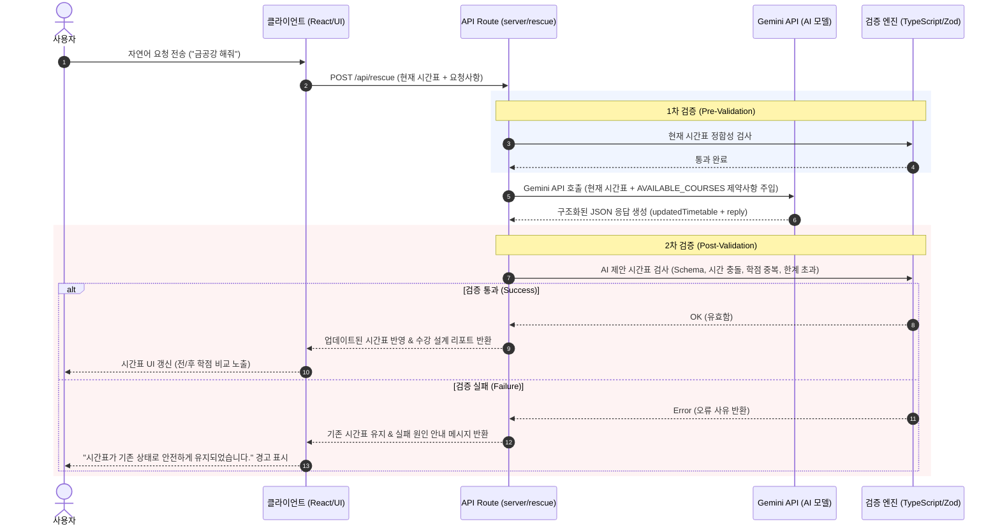

# 🎓 교수님, 이번만요 (Professor, Just Once)

> **"AI가 추천하고, 서버가 안전하게 검증하는 자연어 기반 대학 시간표 시뮬레이션 및 최적화 프로토타입"**

사용자의 자연어 요청에 따라 수강신청 시간표를 실시간으로 변경, 보완, 최적화해 주는 웹 애플리케이션입니다.

---

## 1. 프로젝트 소개
대학생들의 가장 큰 고민 중 하나인 **"수강신청 실패 및 대체 과목 설계"** 문제를 해결하기 위해 기획되었습니다.  
사용자가 "금공강 사수해줘", "1교시 없애줘", "튕긴 과목 대체해줘"와 같은 일상적인 요구사항을 자연어로 입력하면, 시간표 AI 조교가 의도를 파악하여 적절한 대체 수강 계획(Plan A/B/C)을 동적으로 제안합니다.

---

## 2. 문제 정의
기존의 시간표 서비스나 AI 기반 서비스들은 다음과 같은 심각한 한계점을 가지고 있습니다.
1. **AI의 환각(Hallucination)**: AI가 존재하지 않는 가상의 과목, 교수, 강의실을 임의로 지어내어 현실적인 수강 설계에 방해가 됩니다.
2. **검증 없는 적용**: AI가 제안한 시간표 데이터(JSON)에 시간이 겹치거나 범위가 맞지 않는 오류가 존재하더라도, 별도의 유효성 검증 없이 클라이언트에 즉시 반영되어 데이터 정합성이 깨집니다.
3. **학점 중복 가산**: 월/수 등 주 2회 분할된 동일 과목이 여러 시간표 블록으로 들어올 때, 학점이 중복 합산되는 버그가 발생합니다.

---

## 3. 핵심 기능
* **자연어 기반 시간표 최적화**: 챗봇 형태의 UI에서 조교 캐릭터와 대화하며 "금요일 공강 만들기", "아침 수업 제거" 등을 손쉽게 적용할 수 있습니다.
* **다중 플랜 설계 (Plan A, B, C)**: 하나의 시간표에 안주하지 않고, 튕김 처리에 대비한 여러 플랜을 동시에 생성하고 비교할 수 있습니다.
* **자가 진단 학점 역산기**: 기이수 학점, 평점, 졸업 목표 평점을 입력하면 이번 학기 달성해야 하는 권장 학점을 자동으로 역산하여 보여줍니다.
* **수강 설계 리포트**: 시간표 변경 시 "이전 학점 ➔ 이후 학점" 변동 현황을 한눈에 알 수 있게 챗봇이 시각화 리포트를 발행합니다.
* **안전한 데이터 격리 및 복원**: 로컬 스토리지 데이터 오염에 대응하여, 불러오기 시점에 비즈니스 룰 검증을 통과한 데이터만 클라이언트에 반영합니다.

---

## 4. 시스템 구조 & AI 처리 흐름
> [!IMPORTANT]  
> **핵심 아키텍처 원칙**  
> * AI는 오직 **사용자의 자연어 요청을 해석하고 시간표 변경 후보를 생성**하는 역할에 집중합니다.  
> * 최종 시간표의 유효성은 **서버의 비즈니스 로직과 구조화된 검증 시스템이 판단**합니다.



---

## 5. 시간표 검증 구조 (Validation Rules)
서버 검증 엔진(`src/lib/timetable/`)은 다음 4단계 검증 프로세스를 가집니다.
1. **Schema Validation (Zod)**: `id`, `name`, `professor`, `room`, `credits`, `day`, `startHour`, `duration`, `colorIndex` 필드의 데이터 타입과 유효 범위를 철저히 검사합니다.
2. **운영 시간 초과 검사**: 수업 시간 슬롯이 대학 정규 강의 시간대(09:00 ~ 18:00)를 벗어날 경우(예: 17시 시작 + 2시간 수업 = 19시 종료) 즉시 탈락 처리합니다.
3. **시간 충돌 검사 (Conflict Detector)**: 동일 요일 내에 겹치는 수업이 없는지 `(c1.startHour < c2.endHour) && (c2.startHour < c1.endHour)` 공식을 적용해 판단합니다. (단, 튕김/탈락 처리된 과목은 제외)
4. **ID 고유성 검사**: 시간표 상에 동일한 ID가 중복 등록되지 않도록 방지합니다.

---

## 6. 주요 기술 스택
* **Core**: Next.js (App Router), React, TypeScript
* **Styling**: TailwindCSS, Lucide React
* **AI API**: `@google/genai` (Gemini 2.5 Flash 모델 활용)
* **Validation**: Zod (Schema Validation)
* **Testing**: Vitest (Unit Testing)

---

## 7. 환경변수 설정
로컬 환경에서 실제 AI와의 통합 처리를 테스트하기 위해서는 `.env.local` 파일 생성 후 Gemini API 키를 추가해야 합니다.
```env
GEMINI_API_KEY=your_actual_gemini_api_key_here
```
*API Key가 등록되지 않은 경우, 애플리케이션은 **Demo/Fallback 모드**로 자동 동작합니다. 데모 모드에서도 실제 검증 엔진 파이프라인이 동일하게 작동합니다.*

---

## 8. 프로젝트 실행 방법

### 의존성 설치
```bash
npm install
```

### 로컬 개발 서버 실행
```bash
npm run dev
```
브라우저에서 [http://localhost:3000](http://localhost:3000)으로 접속합니다.

### 유닛 테스트 실행
```bash
npm run test
```
Vitest를 활용한 13개 검증 시나리오 테스트가 즉시 실행됩니다.

---

## 9. 프로젝트에서 해결한 기술적 문제
* **비즈니스 로직 격리**: React 컴포넌트 뷰 영역에 커플링되어 있던 학점 연산과 시간 충돌 알고리즘을 순수 TypeScript 라이브러리로 분리하여 결합도를 낮추고 테스트 용이성을 극대화했습니다.
* **학점 중복 합산 방지**: `course.id` 및 `course.name`에서 요일 접미사(`-월`, `-mon` 등)를 추출 및 가공하는 고유 키 생성 메커니즘을 적용해 월/수 분할 강의의 학점 과다 가산 버그를 해결했습니다.
* **강의 환각(Hallucination) 억제**: 사전에 정의된 `AVAILABLE_COURSES` 강의 풀 목록을 AI 프롬프트 컨텍스트에 템플릿 제약 조건으로 바인딩하여, AI가 엉뚱한 교수와 강의실을 지어내는 비율을 0%에 수렴시켰습니다.

---

## 10. 한계점 및 향후 개선 계획
* **실제 대학 포털 연동 부재**: 현재는 가상의 `AVAILABLE_COURSES` 데이터를 활용한 시뮬레이션 단계입니다. 향후 실제 대학 포털의 강의 개설 데이터 수집용 크롤러 혹은 API와 연동해 실시간 과목 매핑 기능을 보완할 예정입니다.
* **이중 전공 / 교차 전공 규칙 유연화**: 전공 학점 이수 제한 규칙 등 대학마다 상이한 이수 룰을 정적으로 관리하고 있어, 이를 사용자 맞춤형 커스텀 룰북 형태로 정의할 수 있는 추가 설정을 구상 중입니다.
